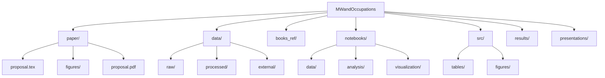

# Minimum Wage and Occupational Dynamics in Russia

**Researchers:** Albert Aina & Yahaya Ali  
**Academic Adviser:** Assoc. Prof. Dmitry Rudenko, Prof. Alexander Nesterov
 
**Institution:** HSE University, St. Petersburg, Russia  
**Program:** Master of Data Analytics for Business and Economics  
**Year:** 2026

## 📋 Research Overview
Empirical analysis of minimum wage effects on occupational structures using in Russia.

## 🔍 Research Questions
1. Which occupations concentrate at minimum wage thresholds?
2. Do minimum wage changes induce occupational transitions across sectors and employment forms?
3. What regional patterns emerge in occupational responses?

## 🏗️ Project Structure



## 🚀 Getting Started

### Prerequisites
- Python 3.8+
- Git
- LaTeX

### Installation
```bash
# Clone repository
git clone https://github.com/AlbertLeo1/MWandOccupations.git
cd MWandOccupations

# Create virtual environment (recommended)
python -m venv venv
source venv/bin/activate  # On Windows: venv\Scripts\activate

# Install dependencies
pip install -r requirements.txt
```
### 📊 Data Sources
RLMS-HSE (Russian Longitudinal Monitoring Survey)
Panel: 1994-2024 (30 years)
Occupational codes (3-digit OKZ)
Regional identifiers
Regional Minimum Wage Data
Federal MW levels (2005-2024)
Regional adjustments (post-2007)

### 👥 Collaboration
Use Issues for feedback
Use Pull Requests for changes
Review all changes before merging

### 📧 Contact
Albert Aina: aaina@edu.hse.ru
Yahaya Ali: asyahaya@edu.hse.ru
Prof. Rudenko: drudenko@hse.ru


**To use:**
1. Go to: `https://github.com/AlbertLeo1/MWandOccupations`
2. Click `README.md`
3. Click pencil icon (✏️)
4. Delete everything, paste the above content
5. Scroll down, commit changes
6. Done!
